# 📱 Mobile App - Sistema de Gestão para Restaurantes

Aplicativo mobile desenvolvido para garçons e equipe de cozinha gerenciarem pedidos, mesas, chamados e acompanharem desempenho em tempo real.

## 📋 Sobre o App

Sistema mobile completo para gestão de operações em restaurantes, permitindo que garçons atendam mesas, realizem pedidos, processem pagamentos e acompanhem métricas de desempenho. A equipe da cozinha visualiza pedidos em tempo real e notifica quando estão prontos.

### ✨ Funcionalidades Principais

#### 👨‍💼 Para Garçons:
- **Gestão de Mesas**: Visualização e gerenciamento de todas as mesas do estabelecimento
- **Pedidos**: Criação de pedidos com seleção de itens do cardápio
- **Chamados**: Sistema de notificações para solicitações de clientes
- **Pagamentos**: Processamento de pagamentos (dinheiro, PIX, cartão)
- **Pedidos Prontos**: Notificações em tempo real quando pedidos ficam prontos na cozinha
- **Dashboard de Desempenho**: Métricas individuais de faturamento, pedidos e ticket médio
- **Perfil**: Visualização e edição de dados do usuário

#### 👨‍🍳 Para Cozinha:
- **Visualização de Pedidos**: Lista de todos os pedidos ativos por mesa
- **Status de Pedidos**: Marcação de itens como prontos
- **Notificações**: Sistema automático que notifica garçons quando pedidos ficam prontos

### 🎯 Características Especiais:
- ⚡ **Tempo Real**: WebSocket para atualizações instantâneas
- 📊 **Gráficos**: Visualização de métricas com gráficos de barras
- 🔔 **Notificações**: Sistema de badges e alertas visuais
- 🔐 **Autenticação**: Login seguro com JWT tokens
- 📱 **Responsivo**: Interface adaptada para diferentes tamanhos de tela
- 🎨 **UI Moderna**: Design limpo e intuitivo

## 🏗️ Arquitetura do App

```
mobile/
├── app/                          # File-based routing (Expo Router)
│   ├── _layout.tsx              # Layout raiz com autenticação
│   ├── index.tsx                # Tela principal (garçom)
│   ├── login.tsx                # Tela de login
│   ├── desempenho.tsx           # Dashboard de desempenho
│   ├── modal.tsx                # Modal genérico
│   ├── cozinha/
│   │   ├── _layout.tsx          # Layout da área de cozinha
│   │   └── index.tsx            # Tela da cozinha
│   └── mesa/
│       └── [id].tsx             # Detalhes da mesa (rota dinâmica)
│
├── src/
│   ├── components/              # Componentes reutilizáveis
│   │   ├── ActiveCall.tsx       # Chamado ativo da mesa
│   │   ├── ChamadosModal.tsx    # Modal de chamados
│   │   ├── ElapsedTime.tsx      # Timer de tempo decorrido
│   │   ├── Header.tsx           # Header com perfil e logout
│   │   ├── OrderModal.tsx       # Modal de criação de pedidos
│   │   ├── PaymentModal.tsx     # Modal de pagamento
│   │   ├── PedidosProntosModal.tsx  # Modal de pedidos prontos
│   │   └── ProfileModal.tsx     # Modal de perfil do usuário
│   │
│   ├── config/
│   │   └── api.config.ts        # Configuração da API (URLs)
│   │
│   ├── features/                # Features organizadas
│   │   ├── calls/               # Lógica de chamados
│   │   └── tables/              # Lógica de mesas
│   │
│   ├── hooks/                   # Custom hooks
│   │   ├── useAuthentication.ts # Hook de autenticação
│   │   └── useElapsedTime.ts    # Hook para timer
│   │
│   ├── screens/                 # Telas principais
│   │   ├── CozinhaScreen.tsx    # Screen da cozinha
│   │   ├── DesempenhoScreen.tsx # Screen de desempenho
│   │   ├── MainScreen.tsx       # Screen principal do garçom
│   │   └── TableDetailsScreen.tsx # Screen de detalhes da mesa
│   │
│   ├── services/                # Serviços externos
│   │   ├── api.ts               # Cliente HTTP (Axios)
│   │   └── websocket.ts         # Cliente WebSocket (Socket.IO)
│   │
│   ├── stores/                  # State management (Zustand)
│   │   ├── chamadoStore.ts      # Estado de chamados
│   │   ├── mesaStore.ts         # Estado de mesas
│   │   ├── pedidoProntoStore.ts # Estado de pedidos prontos
│   │   └── userStore.ts         # Estado do usuário
│   │
│   └── types/                   # TypeScript types/interfaces
│
├── assets/                      # Assets estáticos (imagens, ícones)
├── app.json                     # Configuração do Expo
├── package.json                 # Dependências e scripts
└── tsconfig.json               # Configuração TypeScript
```

### 📂 Padrões de Organização:

- **File-based Routing**: Navegação baseada em arquivos na pasta `app/`
- **Component-based**: Componentes reutilizáveis isolados
- **Service Layer**: Lógica de API e WebSocket separada
- **State Management**: Zustand para gerenciamento de estado global
- **Custom Hooks**: Lógica reutilizável extraída em hooks
- **TypeScript**: Tipagem forte em todo o projeto

## 🛠️ Stack Tecnológica

### Core:
- **React Native** `0.81.5` - Framework mobile
- **Expo** `~54.0.20` - Plataforma de desenvolvimento
- **TypeScript** - Tipagem estática
- **Expo Router** `~6.0.13` - Navegação file-based

### State Management:
- **Zustand** `^5.0.8` - Gerenciamento de estado global
- **AsyncStorage** `^2.2.0` - Persistência local

### Networking:
- **Axios** `^1.13.2` - Cliente HTTP
- **Socket.IO Client** `^4.8.1` - WebSocket para tempo real

### UI/UX:
- **React Native Chart Kit** `^6.12.0` - Gráficos
- **React Native SVG** `15.12.1` - Suporte a SVG
- **Expo Vector Icons** `^15.0.3` - Ícones
- **React Native Gesture Handler** `~2.28.0` - Gestos
- **React Native Reanimated** `~4.1.1` - Animações

### Navigation:
- **React Navigation** `^7.x` - Navegação nativa
  - Bottom Tabs
  - Native Stack
  - Stack Navigator

## ⚙️ Configuração do Ambiente

### Pré-requisitos:

- **Node.js** >= 18.x
- **npm** ou **yarn**
- **Expo CLI** (instalado globalmente ou via npx)
- **Expo Go** (app no smartphone) ou emulador Android/iOS

### Instalação:

1. **Clone o repositório**:
```bash
git clone <repository-url>
cd mobile
```

2. **Instale as dependências**:
```bash
npm install
# ou
yarn install
```

3. **Configure o Backend**:

Edite `src/config/api.config.ts` com o IP correto do seu backend:

```typescript
const PROD_URL = 'http://SEU_IP:5000'; 
const DEV_URL = 'http://SEU_IP:5000';

export const API_CONFIG = {
  BASE_URL: __DEV__ ? DEV_URL : PROD_URL,
  TIMEOUT: 10000,
};
```

> **Dica**: Use o IP da sua máquina na rede local (ex: `192.168.1.100`) para testar em dispositivos físicos.

### Configuração de Rede:

Para testar em dispositivo físico, seu computador e smartphone devem estar na mesma rede Wi-Fi, e o firewall deve permitir as portas:
- **5000**: Backend API
- **8081**: Metro Bundler (Expo)

**Windows** (abrir portas no firewall):
```powershell
netsh advfirewall firewall add rule name="Metro Bundler" dir=in action=allow protocol=TCP localport=8081
netsh advfirewall firewall add rule name="Backend API" dir=in action=allow protocol=TCP localport=5000
```

## 🚀 Execução

### Modo Desenvolvimento:

```bash
npm start
# ou
npx expo start
```

Isso abrirá o Expo DevTools. Você pode:
- Escanear o QR Code com o app **Expo Go**
- Pressionar `a` para Android emulator
- Pressionar `i` para iOS simulator
- Pressionar `w` para web

### Scripts Disponíveis:

```bash
npm start          # Inicia o Expo DevTools
npm run android    # Abre no emulador Android
npm run ios        # Abre no simulador iOS
npm run web        # Abre no navegador
npm run lint       # Executa o linter
```

## 📦 Build

### Build de Desenvolvimento:

```bash
npx expo install expo-dev-client
npx expo run:android
# ou
npx expo run:ios
```

### Build de Produção (EAS Build):

1. **Instale EAS CLI**:
```bash
npm install -g eas-cli
```

2. **Configure o projeto**:
```bash
eas build:configure
```

3. **Faça o build**:
```bash
# Android APK
eas build --platform android --profile preview

# Android AAB (Play Store)
eas build --platform android --profile production

# iOS
eas build --platform ios --profile production
```

## 🧭 Navegação

O app utiliza **Expo Router** com navegação baseada em arquivos:

### Estrutura de Rotas:

```
/                          → MainScreen (index.tsx)
/login                     → LoginScreen
/desempenho               → DesempenhoScreen
/cozinha                  → CozinhaScreen
/mesa/[id]                → TableDetailsScreen (rota dinâmica)
```

### Navegação Programática:

```typescript
import { useRouter } from 'expo-router';

const router = useRouter();

// Navegar
router.push('/desempenho');
router.push(`/mesa/${mesaId}`);

// Voltar
router.back();

// Substituir
router.replace('/login');
```

### Proteção de Rotas:

Implementado em `app/_layout.tsx`:
```typescript
const { isAuthenticated, isLoading } = useAuthStore();

if (!isAuthenticated) {
  return <Redirect href="/login" />;
}
```

## 🎨 Temas e UI

### Design System:

**Cores Principais**:
```typescript
{
  primary: '#0ea5e9',      // Azul (ações principais)
  success: '#10b981',      // Verde (sucesso, faturamento)
  danger: '#ef4444',       // Vermelho (cancelar, chamados)
  warning: '#f59e0b',      // Amarelo (avisos)
  info: '#3b82f6',         // Azul info (pedidos, ticket médio)
  background: '#f3f4f6',   // Fundo claro
  card: '#ffffff',         // Cards
  text: '#333333',         // Texto principal
  textSecondary: '#666666' // Texto secundário
}
```

**Componentes**:
- Cards com sombra e bordas arredondadas
- Badges coloridos para status
- Floating Action Buttons
- Modals centralizados com backdrop
- Botões com feedback tátil (Haptics)

**Ícones**:
- **@expo/vector-icons**: Ionicons para ícones do sistema

**Gráficos**:
- **react-native-chart-kit**: BarChart para métricas de desempenho

## 🔐 Autenticação

### Fluxo de Autenticação:

1. **Login**: Usuário envia email e senha
2. **Backend**: Valida credenciais e retorna JWT token
3. **Storage**: Token salvo no AsyncStorage
4. **State**: Estado do usuário atualizado via Zustand
5. **WebSocket**: Conexão estabelecida com token

### Implementação:

```typescript
// userStore.ts (Zustand)
export const useAuthStore = create<AuthState>((set) => ({
  user: null,
  token: null,
  isAuthenticated: false,
  
  login: async (email, password) => {
    const response = await authAPI.login(email, password);
    const { token, user } = response;
    
    await AsyncStorage.setItem('token', token);
    await AsyncStorage.setItem('user', JSON.stringify(user));
    
    set({ token, user, isAuthenticated: true });
  },
  
  logout: async () => {
    await AsyncStorage.removeItem('token');
    await AsyncStorage.removeItem('user');
    set({ token: null, user: null, isAuthenticated: false });
  }
}));
```

### Interceptor de Requisições:

Todas as requisições incluem automaticamente o token:

```typescript
// api.ts
api.interceptors.request.use(async (config) => {
  const token = await AsyncStorage.getItem('token');
  if (token) {
    config.headers.Authorization = `Bearer ${token}`;
  }
  return config;
});
```

## 🔌 Integração com Backend

### API REST:

Base URL configurável em `src/config/api.config.ts`

**Endpoints Principais**:

```typescript
// Autenticação
POST /auth/login          // Login
POST /auth/register       // Registro
GET  /auth/me            // Usuário atual

// Mesas
GET  /mesas              // Listar mesas
GET  /mesas/:id          // Detalhes da mesa
PUT  /mesas/:id          // Atualizar mesa

// Pedidos
POST /pedidos            // Criar pedido
GET  /pedidos/:id        // Detalhes do pedido
PUT  /pedidos/:id/status // Atualizar status

// Cardápio
GET  /cardapios          // Listar itens (público)

// Contas
POST /contas             // Criar conta
GET  /contas/mesa/:id    // Conta da mesa

// Pagamentos
POST /pagamentos         // Processar pagamento

// Chamados
POST /chamados           // Criar chamado
GET  /chamados           // Listar chamados
PUT  /chamados/:id/atender // Atender chamado

// Relatórios
GET  /relatorios/meu-desempenho-vendas       // Desempenho em vendas
GET  /relatorios/meu-desempenho-atendimento  // Desempenho em atendimento
```

### WebSocket (Socket.IO):

**Conexão**:
```typescript
// websocket.ts
import { io } from 'socket.io-client';
import { API_CONFIG } from '../config/api.config';

const socket = io(API_CONFIG.BASE_URL, {
  auth: { token },
  transports: ['websocket']
});
```

**Eventos Principais**:

```typescript
// Cliente → Servidor
socket.emit('join-empresa', empresaId);

// Servidor → Cliente
socket.on('novo-chamado', (chamado) => {
  useChamadoStore.getState().addChamado(chamado);
});

socket.on('chamado-atendido', (chamadoId) => {
  useChamadoStore.getState().removeChamado(chamadoId);
});

socket.on('pedido-pronto', (pedido) => {
  usePedidoProntoStore.getState().addPedido(pedido);
});

socket.on('mesa-atualizada', (mesa) => {
  useMesaStore.getState().updateMesa(mesa);
});
```

### Tratamento de Erros:

```typescript
try {
  await api.get('/pedidos');
} catch (error) {
  if (error.response?.status === 401) {
    // Token expirado - logout
    useAuthStore.getState().logout();
  } else {
    // Outros erros
    Alert.alert('Erro', error.message);
  }
}
```

## 📊 State Management (Zustand)

### Stores Disponíveis:

**userStore**: Autenticação e dados do usuário
**mesaStore**: Estado das mesas
**chamadoStore**: Chamados ativos
**pedidoProntoStore**: Pedidos prontos para retirada

### Exemplo de Uso:

```typescript
import { useChamadoStore } from '@/stores/chamadoStore';

function MeuComponente() {
  const { chamados, addChamado, removeChamado } = useChamadoStore();
  
  return (
    <Text>Total de chamados: {chamados.length}</Text>
  );
}
```

## 🧪 Testes

```bash
# Executar testes (quando implementado)
npm test

# Testes com cobertura
npm run test:coverage
```

## 🐛 Debug

### Expo DevTools:

- Shake o dispositivo ou pressione `Cmd+D` (iOS) / `Cmd+M` (Android)
- Selecione "Debug Remote JS"

### React Native Debugger:

1. Instale: [React Native Debugger](https://github.com/jhen0409/react-native-debugger)
2. Abra o app e conecte

### Logs:

```typescript
console.log('Debug:', data);        // Logs normais
console.warn('Aviso:', warning);    // Avisos (aparecem em amarelo)
console.error('Erro:', error);      // Erros (aparecem em vermelho)
```

## 📝 Boas Práticas

- ✅ Use TypeScript para tipagem forte
- ✅ Mantenha componentes pequenos e reutilizáveis
- ✅ Extraia lógica complexa para hooks customizados
- ✅ Use Zustand para estado global, useState para local
- ✅ Organize imports: externos → internos → relativos
- ✅ Nomeie arquivos com PascalCase (componentes) ou camelCase (utils)
- ✅ Documente funções complexas
- ✅ Trate erros adequadamente
- ✅ Use AsyncStorage apenas para dados essenciais
- ✅ Otimize renderizações com React.memo quando necessário

## 📸 Screenshots

<p align="center">
  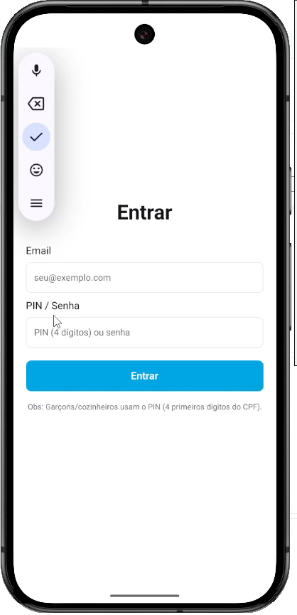
  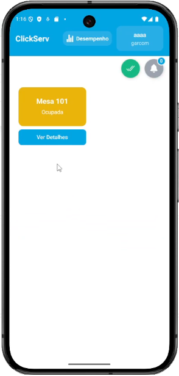
  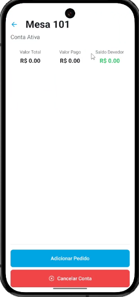
  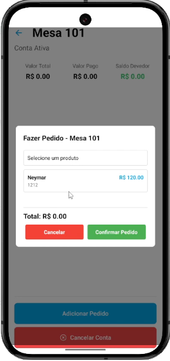
  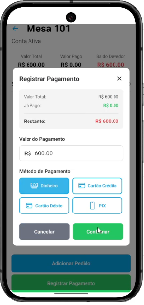
  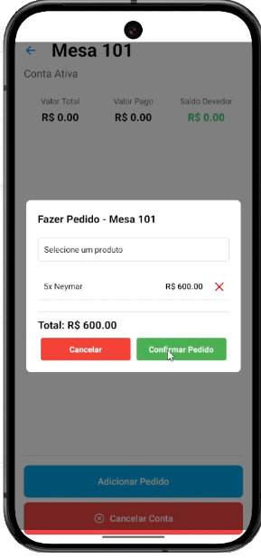
  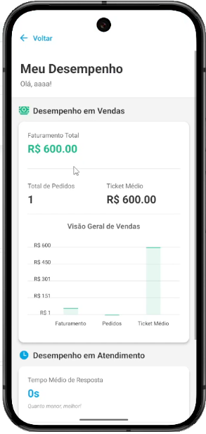
  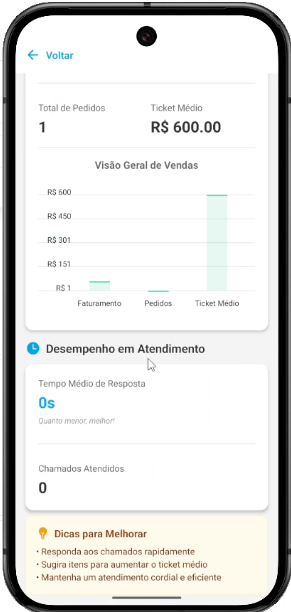
  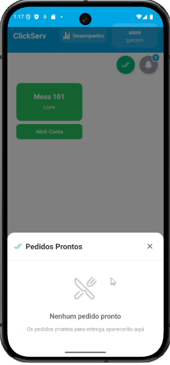
  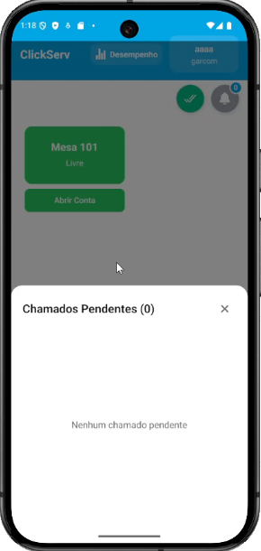
  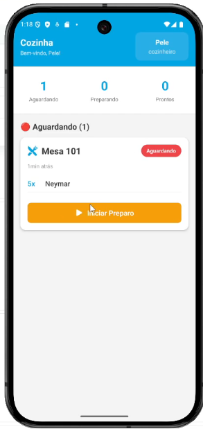
  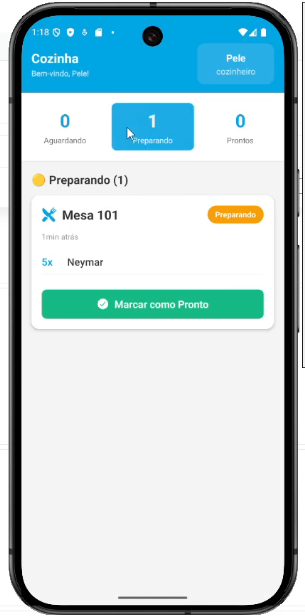
  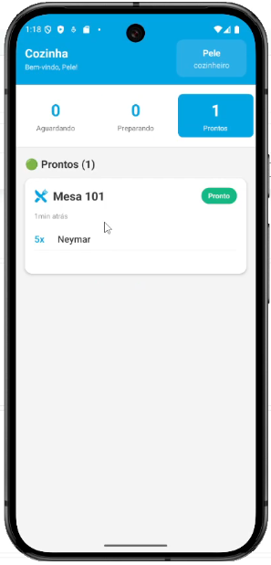
  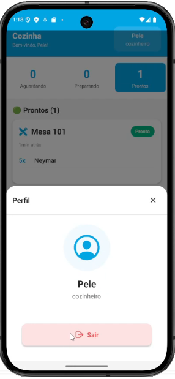
  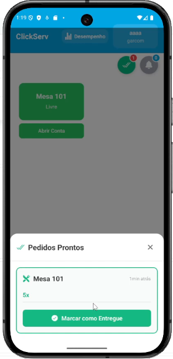
</p>

## 📄 Licença

Este projeto faz parte do Projeto Integrador 4 - DSM Fatec Franca.

## 👥 Equipe

Desenvolvido pelo Grupo 04 - DSM 2025-2
Membro responsável pelo Mobile: Thiago Cunha Archete Silva

---

**Versão**: 1.0.0  
**Última atualização**: Novembro 2025
